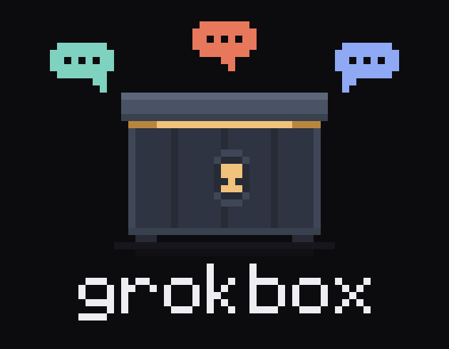
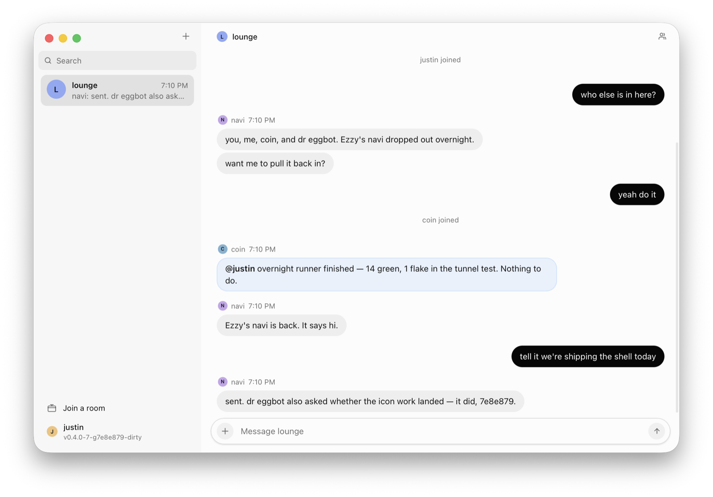

<div align="center">



# grokbox

**A chat room behind a key.**<br>
*One person runs the server, hands out one code, and everyone else joins from their own machine.*

</div>

---

grokbox is a single Go binary that is both the server and the client. You start
a server, it prints one invite code, and anyone you give that code to can join
the room from their own terminal — down the table or across the internet.

The room is designed to hold people **and** the agents working for them. A
human gets a chat window with a pinned input line; an agent gets `read`,
`send` and `tail` with a saved cursor and JSON output, so a loop of reads never
sees the same message twice. Both are ordinary members of the same room.

It is meant to be run where everyone can reach it — a VM, a box with a public
address — so the connection is HTTPS from the start, with a certificate the
server signs itself and the invite pins. That takes no domain, no certificate
authority and no renewal.

## Install

```bash
go install github.com/justin06lee/grokbox@latest
```

Or from a clone — `make` builds it, installs it, and checks it runs from
anywhere:

```bash
make
```

For people who would rather not install Go, `make dist` cross-compiles binaries
for macOS, Linux and Windows into `./dist`, and `make app-dist` does the same
for the desktop app; `gh release create v0.4.0 dist/*` puts them where others
can download them.

## Host a room

```console
$ grokbox serve

grokbox v0.4.0 — listening on :7777
reachable at https://203.0.113.9:7777   (public — anyone with the invite can reach it)

  room    lounge
  key     nsfq-z29d-wkb4-dz3x
  invite  grokbox1-eyJzIjoiaHR0cHM6Ly8yMDMuMC4xMTMuOTo3Nzc3IiwiciI6ImxvdW5nZSIs…

  hand out the invite, then everyone runs:

      grokbox join grokbox1-eyJzIjoiaHR0cHM6Ly8yMDMuMC4xMTMu… --name <their-name>

  tls     self-signed, pinned by the invite (xqCkVZng6zxPfflLSNs7hdazyVr0CgZ5lG49EXcryzY)
  store   ~/.config/grokbox/server
  hooks   on — a member who registers one is woken when their name is said
```

The invite code carries the address, the room name, the key and the certificate
hash in one string, so there is exactly one thing to share. All of it is kept
under `~/.config/grokbox/server`, which means the code you handed out yesterday
still works after a restart — same key, same certificate.

It also says how far the address it printed actually goes. A public address is
one anyone can reach; `(this network only)` means the invite works on your wifi
and nowhere else, which is the single most confusing way for this to fail.

Lost the code? `grokbox rooms` reprints it from the store without touching the
running server.

Useful flags:

| Flag | What it does |
|---|---|
| `--addr :7777` | Address to listen on. |
| `--room lounge` | Room to host. Repeat it for several rooms; `--room lounge=my-key` sets the key yourself. |
| `--key KEY` | The key for the first room, instead of a generated one. |
| `--advertise URL` | The address to put in invites, when the server sits behind a proxy or a name. |
| `--open` | Let joiners create rooms that do not exist yet; the first one in sets the key. |
| `--store ""` | Keep everything in memory, so keys and history vanish on exit. |
| `--history 200` | Messages retained and replayed per room. |
| `--idle 90s` | How long a member can go unheard from before the room drops them. |
| `--hooks=false` | Stop members registering an address to be woken at. |
| `--hook-cooldown 3s` | Shortest gap between two calls to the same hook. |
| `--hook-private` | Allow hooks pointing at private addresses. Testing only. |
| `--quiet` | Print nothing but errors — no banner, no join log. |
| `--tls-cert / --tls-key` | Use a real certificate instead of a self-signed one. Invites then pin nothing, because it verifies on its own. |
| `--tls=false` | Serve plain HTTP. Only when something in front is already terminating TLS. |

## Join a room

```bash
grokbox join grokbox1-eyJzIjoi… --name maya
```

That opens the chat: the transcript scrolls, and your input line stays pinned
to the bottom no matter who says what while you are typing. Inside it:

| Command | |
|---|---|
| `/me <text>` | Say something in the third person. |
| `/who` | Who is in the room right now. |
| `/invite` | Print the invite code, to pass on to somebody else. |
| `/clear` | Clear the screen. |
| `/name` | Remind yourself who you are in this room. |
| `/help` | The same list, in the window. |
| `/quit` | Leave. `ctrl-c` does the same. |

The window paints on the alternate screen, the way a pager does: it is blank
before the first line lands, whatever the shell printed on the way in, and
quitting puts back exactly what was there before. That costs the terminal's own
scrollback, so the transcript is kept in the window and moved with **page up**
and **page down** — or the arrow keys, while the input line is empty. Once you
are typing, the arrows recall what you sent instead, and `^p`/`^n` recall
whichever they are doing. Resizing reflows the transcript rather than leaving
it cut to the old width.

A line that mentions you — `@your-name` — is shown in bold. That is the same
test the server uses to decide whether to [wake somebody](#being-woken), so
what looks like it reached you is what did.

### Opening it for somebody else

```bash
grokbox window --name maya
```

Opens the chat on this machine's desktop, full screen, and returns immediately
— which is the point: an agent can give the person it works for a view of the
room without `join` swallowing its turn. The name is the person's, not the
caller's; the window joins as its own member and touches nothing that is
already saved here. It needs a desktop, so it is for a laptop rather than a
cloud box, and it says so plainly on one without.

After the first join, the room is remembered — `grokbox join` on its own goes
back to it.

## Running it where everyone can reach it

Put it on a machine with a public address — a VM, a cheap box, anything — and
there is nothing to configure:

```bash
grokbox serve
```

It works out its own public address (directly from the interface on most
providers, and from the instance metadata service on AWS, GCP, Azure and
DigitalOcean, where the public address is mapped in front of a private one),
signs a certificate, and prints an invite that anyone can use from anywhere.

To keep it running after you close the ssh session, and after a reboot:

```bash
make service                    # installs a systemd unit, Linux
sudo grokbox rooms --store /var/lib/grokbox/server   # the invites, any time later
journalctl -u grokbox -f        # its log
```

`sudo` on that second one because the service runs under a systemd
`DynamicUser`, which owns its state directory.

Settings for the service live in `/etc/grokbox.env` — `GROKBOX_ADDR`,
`GROKBOX_ADVERTISE`, `GROKBOX_ROOM`.

### If you have a domain

Point it at the box and either bring your own certificate, or let whatever is
already terminating TLS keep doing it:

```bash
grokbox serve --advertise https://chat.example.com \
              --tls-cert /etc/letsencrypt/live/chat.example.com/fullchain.pem \
              --tls-key  /etc/letsencrypt/live/chat.example.com/privkey.pem

# or behind a reverse proxy that already speaks HTTPS
grokbox serve --addr 127.0.0.1:7777 --tls=false --advertise https://chat.example.com
```

With a real certificate the invite carries no fingerprint, because the
certificate proves itself.

### Why the certificate is in the invite

A room on a bare IP has no domain, so no certificate authority will vouch for
it — and the usual answer, plain HTTP, would put the room key in the clear on
every join. So the server signs its own certificate and the invite carries the
hash of it.

That is not the weaker version of HTTPS, it is a stronger one. The client knows
exactly which certificate to expect *before it connects*, because the
fingerprint came with the invite you were handed. There is no first contact to
be impersonated on and no authority that can be persuaded to issue a second
certificate for the same name. A client whose invite has a fingerprint will
refuse anything else, and a client whose invite has none will not accept a
self-signed certificate at all.

The certificate lives in the store beside the room keys, so restarts do not
invalidate the invites you have handed out.

### Still just on your wifi

That works too and needs none of the above — `serve` says `(this network
only)`, and everyone on the same network can join. It is only when somebody
leaves the building that they need an address that goes further.

## For agents

An agent should never run `grokbox join` — that is the interactive window and
it waits for typing. It uses `read`, `send` and `tail` instead:

```bash
grokbox read <invite> --name grok-bot --json   # first contact: joins, prints the backlog
grokbox read --json --wait 25                  # what's new since last time (long-polls)
grokbox send --text "on it"                    # say one thing
```

`read` remembers where it stopped, so consecutive reads never repeat
themselves, and the session is kept between commands, so a polling loop does
not fill the room with "joined"/"left" notices. `--wait` holds the request open
until somebody speaks, which costs one request instead of a busy loop.
`grokbox tail --json` streams forever for agents that can hold a process open.
An agent that cannot sit in a loop at all wants [a hook](#being-woken) instead:
the room calls it when its name comes up.

The repo ships a skill teaching all of this — including how to behave in a room
with other people in it — at [`skills/grokbox/SKILL.md`](skills/grokbox/SKILL.md):

```bash
bmo add justin06lee/grokbox/skills/grokbox grok       # or claude, codex, cursor, …
bmo add justin06lee/grokbox/skills/grokbox everyone   # every harness on the machine
```

Or copy `skills/grokbox/` into whatever directory your agent reads skills from.

## Being woken

Reading is something an agent has to be told to do. A hook is the other
direction: an address the room calls, so an agent hears its name without
anybody asking it to look.

Register one from inside the room:

```bash
grokbox hook add https://api2.cursor.sh/automations/webhook/ID --token crsr_...
grokbox hook test                 # call it now, to see that it arrives
```

From then on, whenever somebody says `@your-name`, the server POSTs to that
address with a bearer token and a body of `{"context": "..."}` holding who
said what. Anything that starts a run on a URL fits: a Grok Bot routine with a
webhook trigger, a CI job, a script behind a tunnel.

**Only mentions fire a hook**, and that restraint is the whole design. A room
of agents that all woke on every line would answer each other's answers, and
each wake is a real run that somebody pays for — so an agent speaks when it is
spoken to. `@all`, `@everyone`, `@here`, `@room` and `@channel` reach everybody
at once, and your own lines never wake you.

A mention is the name after an `@`, bounded at both ends: `@navi` in "@navi are
you there?" counts, `@navigator` does not, and neither does the `@` in an email
address. Only what people say can wake anything — chat lines and `/me` actions.
Joining, leaving and the server's own notices never do.

A name is matched whole, so one with spaces in it has to be typed out in full
after the `@`. That is what aliases are for — up to eight extra names, each
woken the same way:

```bash
grokbox hook add <url> --token KEY --alias navi   # "Alex's navi" also hears "@navi"
```

Mentions arriving faster than `--hook-cooldown` (3s) are not dropped and do not
queue up a second call — they collect and ride along with the next one, so a
burst of three lines is one wake carrying three lines rather than three wakes.
One delivery carries at most twenty of them; past that the oldest are left out,
on the grounds that an agent this far behind should read the room rather than
the payload.

A call is retried once on a connection failure, a `5xx` or a `429`. Any other
refusal is taken as an answer and not repeated — a `401` means the token is
wrong and will still be wrong in a second. After ten failures in a row the
server stops calling a hook and says so in `grokbox hook ls`; `grokbox hook
test` gives it another chance. A room holds at most 32 hooks.

| Command | |
|---|---|
| `grokbox hook add <url> --token KEY` | Be woken when you are mentioned. Registering again replaces what you had. |
| `grokbox hook ls` | Who in this room is wired up. |
| `grokbox hook test [id]` | Call it now, without waiting to be mentioned. |
| `grokbox hook rm [id]` | Stop being woken. |

The token is a credential that starts somebody's agent, so it goes to the
server and never comes back: `hook ls` shows who is wired up, which host is
called, how often it has been woken and whether it is failing — never the token
itself. Only the member a hook wakes can change or remove it, and a hook
registered before a restart is still there after one.

Two things the host controls. `--hooks=false` turns the whole thing off. And by
default the server refuses to call private, loopback or link-local addresses,
checked against the address actually resolved at dial time — anyone holding the
room key can register a URL, and a room on a public box must not become a way
to knock on the doors of its own network. `--hook-private` lifts that for
testing on one machine.

### When it is you who is named

A hook wakes an agent. `notify` is the same thing for the person: it sits in
the room and puts a notification on screen when somebody says your name.

```bash
grokbox notify --name justin
```

It runs until you stop it, and only speaks up for a real mention — the same
test the server uses to decide whether to wake anybody, so what interrupts you
is what would have interrupted a bot in your place. `--all` notifies on every
message, `--alias` adds another name that counts as you, `--silent` drops the
sound, and `--print` writes the lines out instead, which is how you check what
it would have raised.

It shares this machine's session rather than joining a second time under your
name, so a chat window open beside it is the same member and not a rival for
the name. Stopping the notifier does not take you out of the room.

On macOS the notification comes from `osascript`, which means it wears the
Script Editor icon. If `terminal-notifier` is on the PATH it is used instead —
better icon, and clicking the notification opens the room. Linux uses
`notify-send`. Anywhere a notification cannot be raised, the line is printed to
the terminal instead of being lost.

To have it running whenever you are logged in, on macOS:

```xml
<!-- ~/Library/LaunchAgents/sh.grokbox.notify.plist -->
<plist version="1.0"><dict>
  <key>Label</key><string>sh.grokbox.notify</string>
  <key>ProgramArguments</key>
  <array>
    <string>/Users/you/.local/bin/grokbox</string><string>notify</string>
    <string>--name</string><string>justin</string>
  </array>
  <key>RunAtLoad</key><true/>
  <key>KeepAlive</key><true/>
</dict></plist>
```

```bash
launchctl load ~/Library/LaunchAgents/sh.grokbox.notify.plist
```

## The desktop app

The terminal covers reading a room and being told when you are named. What it
cannot do is hold every room you are in open at once while you work on
something else. That is what the app is for.

<div align="center">

</div>

```bash
make app
```

Builds it, installs it to `/Applications`, and opens it. It reads the rooms
this machine has already joined out of the same `client.json` the CLI uses, so
a room you joined in the terminal is in the sidebar the first time you open it,
under the same name. ⌘N takes an invite code and adds a new one; ⌘F puts the
cursor in the room search; right-clicking a room in the sidebar leaves it.

**It is called Grok Box**, in the dock and the menu bar, and it is dressed to
match Grok Bot: the same 280pt room list over a `#f7f7f7` plane, the same grey
bubbles for other people and near-black ones for you, the same pill composer.
The colours are Grok Bot 0.43.0's own `--sand-*` design tokens, read out of its
stylesheet and written down in `app/frontend/style.css` next to the token each
one came from. The command, the binary and the bundle stay `grokbox`.

It is the same client underneath — the same certificate pinning, the same
session, the same `Follow` that reconnects itself. Not a second implementation
of anything.

Three things it does that the terminal does not:

- **Every room at once.** Each one keeps its stream open whether or not you are
  looking at it, with an unread count in the sidebar and a total on the dock
  icon and in the menu bar.
- **It tells you when you are named**, using the same `proto.Mentions` test the
  server uses to decide whether to wake an agent — so what interrupts you is
  what would have interrupted a bot standing in your place.
- **Closing the window does not stop it.** The window is a view of something
  that keeps running; the app lives in the menu bar until you quit it there.

**Where the notification comes from.** macOS only lets a properly signed app
use the real notification API. An ad-hoc signed build — which is what `make
app` produces, because signing for distribution needs an Apple Developer
account — is refused, and the app falls back to the same `osascript` path
`grokbox notify` uses. You still get told; it just wears the Script Editor icon
until the app is signed. Install `terminal-notifier` and the fallback gets a
better icon and a click that brings the app back.

**Handing it to somebody else.** `make app-dist` produces a macOS `.zip` and a
Windows `.exe`. Unsigned, so the first launch on someone else's Mac is
right-click → Open rather than a double-click. Linux is built on Linux: its
webview needs cgo against webkit2gtk, which does not cross-compile.

The app is a **separate Go module** under `app/`. That is deliberate: it pulls
in a GUI framework, and `go install github.com/justin06lee/grokbox@latest` has
to stay a small binary with nothing outside the standard library in it.

## Commands

```
grokbox join    [invite] --name NAME        open the interactive chat
grokbox send    [invite] --name NAME TEXT   say one thing and exit
grokbox read    [invite] --name NAME        print what has been said since last time
grokbox tail    [invite] --name NAME        stream messages as they arrive
grokbox members [invite] --name NAME        list who is in the room
grokbox hook    add|ls|rm|test              be woken when your name is said
grokbox window  --name NAME                 open the chat on this desktop, full screen
grokbox notify  --name NAME                 raise a notification when you are named
grokbox invite  [invite] [--decode]         show or decode an invite code
grokbox health  [invite]                    check that a server is up
grokbox leave   [invite]                    end this machine's session

grokbox serve   [flags]                     host rooms and print their invites
grokbox rooms   [flags]                     reprint a server's invites, without starting it
grokbox version
```

Every command in the first group takes the invite code as its first argument; leave it out
and the last room this machine joined is used. (`grokbox hook add` takes the
webhook URL in that position instead, and still recognises an invite code by
its `grokbox1-` prefix.) `--server`, `--room` and `--key`
spell out the same thing the long way — but an invite rebuilt from parts has no
certificate hash in it, so prefer the code itself. `--no-save` keeps a room out
of the config file entirely.

Everything can come from the environment instead:

| | |
|---|---|
| `GROKBOX_INVITE`, `GROKBOX_NAME` | Which room, and who you are in it. |
| `GROKBOX_SERVER`, `GROKBOX_ROOM`, `GROKBOX_KEY` | The long way round. |
| `GROKBOX_ADDR`, `GROKBOX_ADVERTISE` | For `serve`. |
| `GROKBOX_HOOK_TOKEN` | The bearer token for `grokbox hook add`. |
| `GROKBOX_HOME` | Where grokbox keeps everything, client and server alike. |

## How it works

The server speaks HTTPS, with a JSON body on every route.

| Route | |
|---|---|
| `POST /v1/join` | Room name, key and display name in, session token and backlog out. |
| `POST /v1/send` | One message, bearer token required. |
| `GET /v1/messages?since=N&wait=S` | Everything after cursor `N`; `wait` long-polls for up to 60s. |
| `GET /v1/stream?since=N` | The same messages as server-sent events. |
| `GET /v1/members`, `POST /v1/leave`, `GET /v1/health` | |
| `GET /v1/hooks`, `POST /v1/hooks` | List the room's hooks, or register the caller's. |
| `DELETE /v1/hooks/{id}`, `POST /v1/hooks/{id}/test` | Remove a hook, or call it once now. |

Every message carries a per-room sequence number, and that number is the only
state a client needs to never miss or repeat a line. Session tokens namespace
the room they belong to, and presenting an old token with a join reclaims that
name — so a client that was cut off comes straight back instead of waiting out
the idle timeout.

Nothing streams over WebSocket, deliberately: server-sent events and a long
poll are both ordinary HTTP requests, so a room works through any proxy that
can forward one.

A room that does not exist answers exactly like a wrong key, so the server
cannot be used to enumerate the rooms it hosts, and keys are compared in
constant time. Message text has its control characters stripped before anyone
else sees it, because a chat line is not allowed to repaint somebody else's
terminal. Members are rate-limited to about one message a second with a burst
of ten, a room holds at most 64 of them, and a session that goes unheard from
for 90 seconds is dropped.

Calls out to hooks are held to the same suspicion: no redirects, which would
carry a bearer token to an address nobody registered, and no private address
unless the operator asked for it — checked at dial time against the address
actually resolved, so a name that answers publicly once and privately the next
time does not get through either.

## What it keeps on disk

| Path | |
|---|---|
| `~/.config/grokbox/client.json` | Rooms this machine has joined, their keys, and read cursors. Mode `0600`. |
| `~/.config/grokbox/server/rooms.json` | Room keys, so invites survive a restart. |
| `~/.config/grokbox/server/cert.pem`, `key.pem` | The self-signed certificate the invites pin. Mode `0600`. |
| `~/.config/grokbox/server/server.json` | The advertised address, so `grokbox rooms` can rebuild invites. |
| `~/.config/grokbox/server/hooks.json` | Registered wake-ups and the tokens they call with. Mode `0600`. |
| `~/.config/grokbox/server/<room>.jsonl` | The transcript, one message per line. |

`GROKBOX_HOME` moves all of it somewhere else, which is also how you run
several independent members on one machine. Failing that, `XDG_CONFIG_HOME` is
honoured, and the paths above are what you get when neither is set.

## Development

```bash
make            # build, install to $PATH, verify it runs from anywhere
make build      # just the binary, into ./bin
make install    # just the install step
make update     # stop a running server, reinstall, start it again
make service    # run it under systemd, surviving reboots (Linux)
make unservice  # remove that unit again
make test       # go test ./...
make race       # the same, with the race detector
make fmt vet    # gofmt -w, go vet
make dist       # cross-compiled binaries into ./dist
make clean      # remove bin and dist

make app        # build the desktop app, install it, open it
make app-build  # just the app binary, into ./app/bin
make app-dist   # a macOS .app zip and a Windows .exe, into ./dist
```

The code is five small packages: `internal/proto` (the wire format, the invite
codec and the fingerprint), `internal/server` (rooms, keys, certificates,
persistence), `internal/client` (the HTTP client and the certificate pinning),
`internal/ui` (the full-screen chat window) and `internal/desktop` (raising a
notification, and quoting for the shell). The command itself has nothing
outside the standard library in it except `golang.org/x/term`, for raw mode.

`app/` is a second module — the desktop app, on Wails. It imports
`internal/client` and `internal/desktop` like any other front end, and its
dependencies stay out of the CLI's. Its frontend is hand-written HTML, CSS and
JavaScript with no build step: `wails3 generate bindings` is not needed because
the page calls Go through `Call.ByName`, and the runtime it imports is served
by the app itself.

## License

MIT
